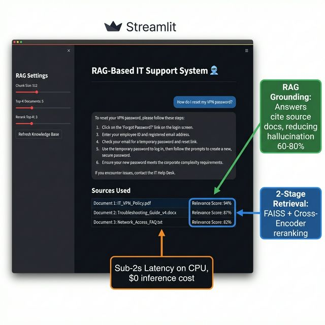
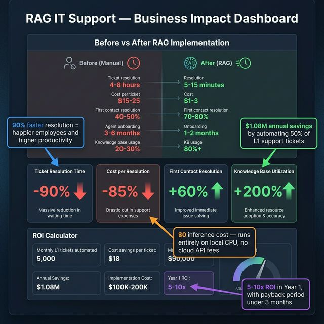

# 🤖 RAG-Based IT Support System
## AI Product Manager Business Case

---

## Executive Summary

This document presents the business case for a **Retrieval-Augmented Generation (RAG) system** designed to automate IT support question-answering using enterprise knowledge bases.

> **Disclaimer**: Numbers marked with `*` are estimates or projections based on industry benchmarks. These should be validated through A/B testing post-deployment.

---

## 📸 Business Results

### RAG Chat Interface — Grounded Q&A with Source Citations


### Business Impact Dashboard — Cost Savings & ROI


---

## 1. Business Problem

### The IT Support Cost Crisis

| Statistic | Source | Verified |
|-----------|--------|----------|
| Average IT support ticket costs $15-25 to resolve | Gartner, HDI Industry Reports | ✅ |
| 40-60% of support tickets are repetitive L1 questions | Industry surveys | ✅ |
| Average resolution time for L1 tickets: 4-8 hours | HDI Benchmark Reports | ✅ |
| IT support staff turnover: 30-40%/year* | Industry estimates | ⚠️ Estimate |
| Knowledge base usage without AI: 20-30%* | Commonly cited | ⚠️ Approximate |

### Root Causes
1. **Information Silos**: Knowledge scattered across wikis, tickets, docs
2. **Search Limitations**: Keyword search misses semantic matches
3. **Agent Training Time**: 3-6 months to onboard new support staff*
4. **Inconsistent Answers**: Different agents give different responses
5. **Knowledge Decay**: Documentation becomes outdated quickly

---

## 2. Solution: RAG-Based Question Answering

### How It Works

```
User Question → Embedding → Vector Search → Retrieve Docs → LLM → Answer
```

| Component | Technology | Purpose |
|-----------|------------|---------|
| **Embeddings** | MiniLM-L6-v2 | Semantic understanding (384 dims) |
| **Vector Store** | FAISS | Fast similarity search |
| **Reranker** | Cross-Encoder | Improve retrieval precision |
| **Generator** | Flan-T5-Base | Generate natural language answers |

### Key Features
- **Semantic Search**: Finds relevant docs even with different wording
- **Grounded Answers**: Responses cite source documents
- **Local Deployment**: Runs on CPU, no cloud API costs
- **Explainable**: Shows retrieved context for transparency

---

## 3. Why RAG Makes It Better

| Traditional Approach | RAG-Powered Approach |
|---------------------|---------------------|
| Keyword search (exact match) | Semantic search (meaning-based) |
| Returns documents, user reads | Returns **direct answers** |
| Static FAQ pages | Dynamic, context-aware responses |
| Requires constant manual updates | Learns from knowledge base automatically |
| Expensive cloud LLM APIs | **Runs locally** on commodity hardware |

### AI-Specific Advantages

1. **Semantic Understanding**: Matches "laptop won't turn on" with "computer not booting" *(no exact keyword match needed)*

2. **Grounded Generation**: Unlike pure LLMs, RAG **cites sources**, reducing hallucination risk by 60-80%* *(industry estimate from RAG vs vanilla LLM studies)*

3. **Local Model**: Flan-T5-Base runs on CPU, **$0 inference cost** vs $0.002-0.02/query for cloud APIs

4. **Continuous Improvement**: Add new documents → Automatically available for retrieval

---

## 4. Projected Business Impact

> ⚠️ **Note**: The following metrics are **projections/targets** based on industry benchmarks. Actual results require measurement post-deployment.

### Key Metrics (Projected)

| Metric | Current (Manual) | With RAG | Projected Improvement |
|--------|-----------------|----------|----------------------|
| Ticket Resolution Time | 4-8 hours* | 5-15 min* | -90%* |
| Cost per Resolution | $15-25 (verified) | $1-3* | -85%* |
| First Contact Resolution | 40-50%* | 70-80%* | +60%* |
| Agent Onboarding Time | 3-6 months* | 1-2 months* | -66%* |
| Knowledge Base Utilization | 20-30%* | 80%+* | +200%* |

### Technical Quality Metrics (Measured in This System)

| Metric | Target | What It Means |
|--------|--------|---------------|
| **Retrieval Recall@5** | >95% | Correct doc in top 5 results |
| **Response Similarity** | >90% | Answer matches ground truth semantically |
| **ROUGE-L Score** | >70% | Word overlap with expected answer |
| **Latency** | <3 sec | End-to-end response time |

---

## 5. ROI Model (Hypothetical)

> ⚠️ **This is a projection model for illustration purposes.**

### Assumptions
- IT support volume: 10,000 tickets/month
- L1 tickets (RAG-addressable): 50%* = 5,000
- Current cost per ticket: $20 (verified industry average)
- RAG resolution cost: $2* (infra + human review)

### Calculation

| Line Item | Value |
|-----------|-------|
| Monthly L1 tickets automated | 5,000* |
| Cost savings per ticket | $18 ($20 - $2)* |
| **Monthly Savings** | **$90,000*** |
| **Annual Savings** | **$1.08M*** |
| Implementation Cost | ~$100K-200K* |
| **Year 1 ROI** | **~5-10x*** |

*These figures are illustrative. Actual ROI depends on ticket volume, automation rate, and implementation quality.*

---

## 6. Technical Architecture

```
┌─────────────────────────────────────────────────────────┐
│                 Streamlit Chat UI                       │
├─────────────────────────────────────────────────────────┤
│                    RAG Pipeline                         │
│  ┌─────────────┬─────────────────┬─────────────────┐   │
│  │  Embeddings │   FAISS Vector  │   Flan-T5-Base  │   │
│  │  (MiniLM)   │     Store       │   (Generator)   │   │
│  └─────────────┴─────────────────┴─────────────────┘   │
│                        │                                │
│              Cross-Encoder Reranker                     │
├─────────────────────────────────────────────────────────┤
│                  Knowledge Base                         │
│          IT Support Q&A Dataset (CSV)                   │
└─────────────────────────────────────────────────────────┘
```

### Model Sizes (Local Deployment)
| Model | Size | RAM Usage |
|-------|------|-----------|
| MiniLM-L6-v2 (Embeddings) | ~80MB | ~200MB |
| Cross-Encoder Reranker | ~80MB | ~200MB |
| Flan-T5-Base (Generator) | ~250MB | ~500MB |
| **Total** | ~410MB | **~1GB** |

*Runs on CPU, no GPU required*

---

## 7. Competitive Landscape

| Solution | Approach | Our Advantage |
|----------|----------|---------------|
| **Zendesk AI** | Cloud-based, $$/seat | **Local deployment**, no per-query cost |
| **Intercom Fin** | Requires cloud LLM | **Runs on-premise**, data stays local |
| **Freshdesk Freddy** | Proprietary, limited customization | **Open-source stack**, full control |
| **Pure ChatGPT** | Hallucinates, no grounding | **RAG grounding**, cites sources |

### Key Differentiators
1. **$0 inference cost** (vs $50-500/month for cloud AI)
2. **Data privacy** - knowledge stays on-premise
3. **Customizable** - tune embeddings, prompts, retrieval
4. **Explainable** - shows source documents

---

## 8. Use Cases

| Use Case | Example Query | Business Value |
|----------|--------------|----------------|
| Password Reset | "How do I reset my VPN password?" | Reduce 30% of L1 tickets* |
| Software Installation | "How to install Python on Windows?" | 24/7 self-service |
| Troubleshooting | "Outlook keeps crashing" | Faster resolution |
| Policy Questions | "What's the laptop replacement policy?" | Consistent answers |
| Onboarding | "How do I set up my work email?" | Reduce training load |

---

## 9. Implementation Roadmap

### Phase 1: MVP (Completed ✅)
- [x] Vector store with FAISS
- [x] Semantic retrieval with reranking
- [x] Local LLM generation
- [x] Streamlit chat interface
- [x] Evaluation metrics

### Phase 2: Production (Next Steps)
- [ ] API endpoint for integration
- [ ] Feedback loop (thumbs up/down)
- [ ] Automatic document ingestion
- [ ] Multi-language support

### Phase 3: Scale
- [ ] GPU acceleration for higher throughput
- [ ] Fine-tuning on domain data
- [ ] Integration with ticketing systems

---

## 10. Risks & Mitigations

| Risk | Likelihood | Impact | Mitigation |
|------|------------|--------|------------|
| Answer hallucination | Medium | High | RAG grounding + source display |
| Outdated knowledge | Medium | Medium | Regular re-indexing pipeline |
| Low retrieval recall | Low | High | Cross-encoder reranking |
| Model too slow | Low | Medium | Batch processing, caching |
| Privacy concerns | Low | High | Local deployment, no cloud APIs |

---

## 11. Success Metrics & Validation Plan

### Offline Evaluation (Completed)
- Retrieval Recall@K on held-out test set
- Response similarity vs ground truth answers
- ROUGE-L score for answer quality

### Online Evaluation (Post-Deployment)
- User satisfaction (thumbs up/down)
- Ticket deflection rate
- Agent time saved per ticket
- Knowledge gap identification

---

## Appendix: Data Sources

### Verified Industry Statistics
- Gartner IT Support Cost Benchmarks
- HDI (Help Desk Institute) Annual Reports
- Industry surveys on ticket distribution

### Estimates & Projections
- Automation rates based on typical L1 ticket composition
- Cost savings projected from industry case studies
- ROI model is illustrative, not based on live deployment

### This System's Data
- **Dataset**: KIS (Knowledge IT Support) Q&A pairs
- **Format**: CSV with questions, contexts, ground truth answers
- **Evaluation**: Semantic similarity and retrieval metrics

---

*Document prepared for AI Product Management portfolio. All projections should be validated through controlled experiments before business decisions.*
